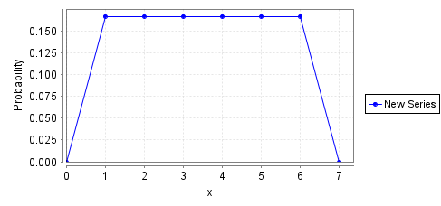
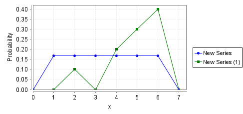
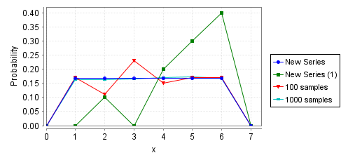

# PRISM Tutorial - Knuth Die
This is the write-up for the Knuth Die PRISM example. All questions posed in the tutorial are answered in this file. 

## Exploring the model in PRISM

### What is the final value of s? It should be 7. What is the value of the die?

s does indeed have a final value of 7 for all traces. The die's value depends on which path the model ends up taking and can range from 1 to 6, as we'd expect. 

### What is the minimum path length you observe? What is the maximum?

The minimum path length observed is 4 steps (The 4th step seems to be a settling of the state before it). The maximum path length I have observed is 8 steps. However, in principle, there exists a path where the model endlessly loops between two states (e.g. s=2 and s=6) resulting in an unbounded max step count. 

## Model checking with PRISM

### What does phi mean in this case? What does the property mean?

phi is the proposition: " s=7 & d=x " meaning our state (s) is 7 and our die value (d) is set to some variable integer value.

###  Is the answer (verification) as you expected?

Yes, the probability of satisfying s=7 & d=6 (i.e. the die landing on 6) is approximately 0.1666665077 which is very nearly the expected 1/6 probability in real life. 

### Check the log again and see many more iterations were required.

The probability was even more precise than the original value, roughly 0.1666666666569654. It required 36 iterations (as compared to the original 22) for the Jacobi. 

### See plot.png

## Statistical model checking with PRISM

### How are good are these approximate results?

See plot2.png

These results do not match our previous results and are not an accurate description of the system. 

### How many samples do you need to get results close to those generated through verification?

See plot3.png

It seems the default of 1000 this preferable as compared to graphs with lower numbers of samples. We can clearly see that the 10-sample and 100-sample experiments do no accurately represent the system. While the 1000-sample experiment is much closer to the actual expected probability distribution, it is still imperfect, and we can still see some areas where there is a little bit of error. 

## Expected termination time

### Before you do this, can you compute the result by hand?

The average step count can be modeled by the following sum: n = [0, infinity), sum[ (3+2n) * (0.75) * (0.25)^n]. 
This converges to the value 3.666666... or 11/3.

### What should phi be in order to compute the expected number of steps that the algorithm requries to compute a value for the die?

Since we want to compute when the die has "landed", we want a state that satisfies "s=7".

### What is the result?

The result is: 3.6666666662786156, very near our expected result of 11/3. 