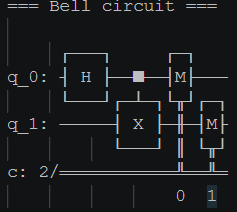
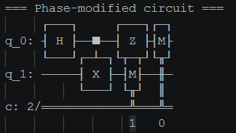
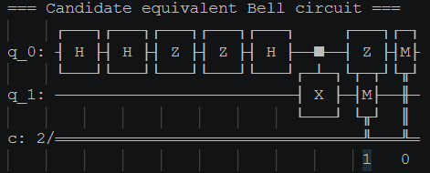
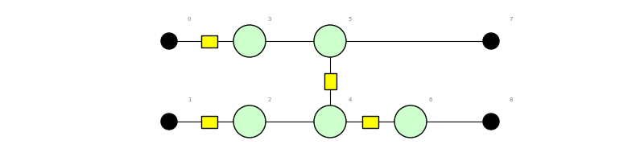

# HW 12 Quantum Homework: Qiskit and PyZX

## Part 1

### Q1

{'00': 498, '11': 526}

Since the qubits are entangled with one another in the Bell state, they must share the same quantum state. So if the state is 0 for one of them then it must be for both of them, i.e. 00 or 11. 

### Q2

{'00': 530, '11': 494}

1. Do the measurement counts change in the computational basis?

    The measurement counts change slightly but still hover around 50% for each entangled state (00 and 11).

2. What changed about the quantum state even if the measurement counts look the same?

    The Z gate flips the phase, resulting in a negative phase for those in state 1. This does not change the probability of measuring them however. 

3. Why is this an example of information that can be hidden from a single measurement basis?

    Becasuse this particular change in phase does not effect the probabilities of measurement, there isn't really a way to tell there is even a difference without using other gates to see the quantum effects. 

### Q3

{'11': 538, '00': 486}

The counts alone are not enough to prove equivalence. As we demonstrated with the change in phase, not all changes are measurable as is. So even though we can do endless simulations and get the same average measurements, that does not guarantee that the circuits are equivalent. 

## Part 2

### Q4

### Q5

Original Circuit Stats:
Circuit(2 qubits, 0 bits, 2 gates)
qubits: 2
gates: 2
two-qubit gates: 1

Simplified Circuit Stats:
Circuit(2 qubits, 0 bits, 4 gates)
qubits: 2
gates: 4
two-qubit gates: 1

Simplified Circuit:

Explanation:
The CNOT gate was simplified into 3 Hadamard gates, bringing the total number of gates to 4. Essentially, we are expressing what was originally a red spider for q1 as a green spider using identity rules. 

### Q6

* The original and simplified circuits are indeed recognized as equivalent. In this context, that means that the two circuits have qubits that always result in the same quatum states as that of the other circuit. In other words, they "prepare" the qubits in the same way even if the methodology of getting to that state differs slightly. 

* As explained before, the quantum states can differ even if the measurements do not. By introducing this phase-modification, we are definitely changing the quantum state relative to the original circuit, which means that they CANNOT be equivalent circuits since they produce different quantum states. 

